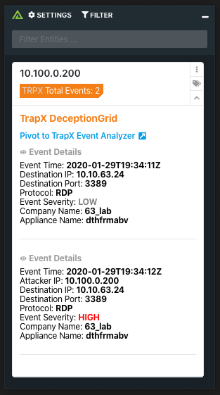

# Polarity TrapX DeceptionGrid Integration

The Polarity TrapX integration allows Polarity to search the TrapX DeceptionGrid API to return event information on IP addresses.

To learn more about TrapX please see their official website at [https://trapx.com/product/](https://trapx.com/product/)

## TrapX TSOC URL
The base URL for your TrapX Security Operation Console (TSOC) including the schema (i.e., https://) and port (e.g., https://mytrapx:8443)

## TrapX TSOC API Key
Valid TrapX TSOC API key.  Available via https://mytrapx:8443/settings-apikey.  Ensure that you use the "Main API Key", NOT the "Token API Key."

## Trap Type to Search
Search Events with the specified Trap Type (Full OS, Emulation or NIS).

## Installation Instructions

Installation instructions for integrations are provided on the [PolarityIO GitHub Page](https://polarityio.github.io/).

## Polarity

Polarity is a memory-augmentation platform that improves and accelerates analyst decision making.  For more information about the Polarity platform please see:

https://polarity.io/
